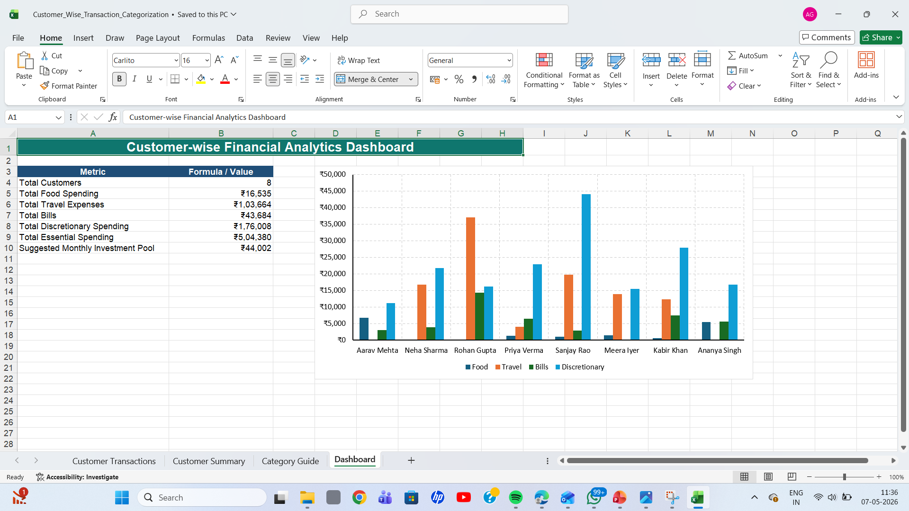
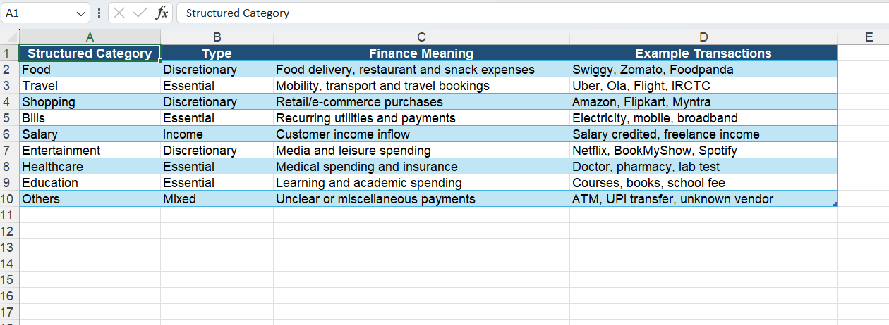
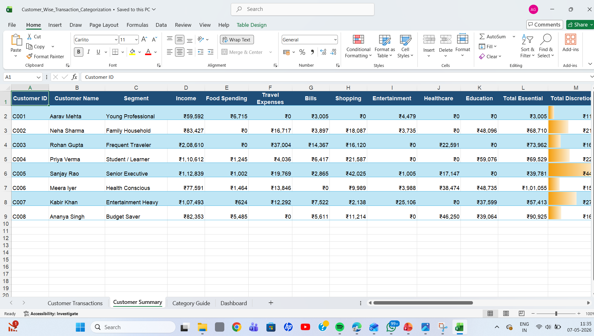
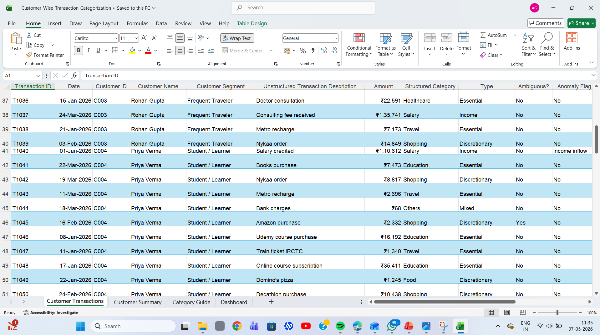

# 📊 Excel Analytics Dashboard Project

## 📌 Project Overview
This project demonstrates an interactive **Excel-based Analytics Dashboard** designed to analyze customer transactions, categories, and business insights using advanced Excel visualization techniques.

The dashboard provides:
- Customer transaction analysis
- Category-wise insights
- Summary dashboards
- Business performance tracking

---

# 🛠️ Tools Used
- Microsoft Excel
- Pivot Tables
- Charts & Graphs
- Data Cleaning Techniques
- Dashboard Design

---

# 📂 Project Files

| File Name | Description |
|-----------|-------------|
| Dashboard.png | Main analytics dashboard |
| category_guide.png | Category analysis guide |
| customer_summary.png | Customer summary insights |
| customer_transaction.png | Customer transaction analysis |

---

# 📸 Project Screenshots

## 📊 Main Dashboard

---

## 🗂️ Category Guide

---

## 👥 Customer Summary

---

## 💳 Customer Transaction Analysis

---

# 🚀 Key Features
- Interactive Excel Dashboard
- Data-driven insights
- Customer behavior analysis
- Category performance tracking
- Easy-to-understand visual reports

---

# 📈 Business Value
This dashboard helps businesses:
- Track customer transactions
- Analyze category performance
- Improve decision-making
- Monitor business KPIs effectively

---

# 🎯 Learning Outcomes
Through this project, I learned:
- Excel dashboard development
- Data visualization
- Pivot table analysis
- Business reporting techniques
- Data cleaning & formatting

---

# 👩‍💻 Author
## Shreya Thakkar

GitHub: [shreyathakkar0410](https://github.com/shreyathakkar0410)

---
